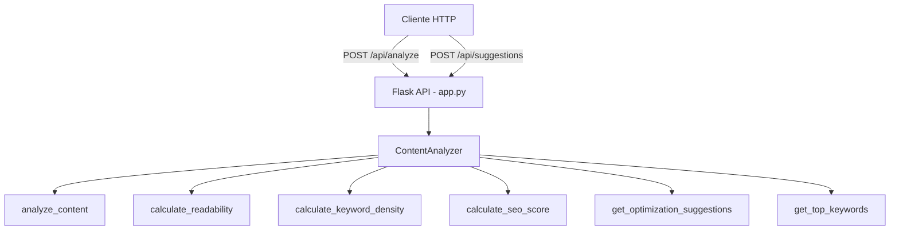

# Content-Optimization-Suite

Suite de otimizacao de conteudo com analise de legibilidade, contagem de palavras, densidade de palavras-chave, pontuacao SEO e sugestoes de melhoria via API Flask.

Content optimization suite with readability analysis, word count, keyword density, SEO scoring and improvement suggestions via Flask API.

[Portugues](#portugues) | [English](#english)

---

## Portugues

### Descricao

Este projeto fornece uma classe `ContentAnalyzer` que analisa textos e retorna metricas como:

- Contagem de palavras e caracteres
- Contagem de frases e paragrafos
- Media de palavras por frase
- Pontuacao de legibilidade (aproximacao da formula Flesch Reading Ease usando uma constante fixa de 1.5 silabas por palavra em vez de contagem real de silabas)
- Densidade de palavras-chave para uma palavra-chave alvo
- Pontuacao SEO baseada em comprimento do conteudo, estrutura, contagem de frases e densidade de palavras-chave
- Top 10 palavras-chave mais frequentes (excluindo stop words)
- Sugestoes de otimizacao baseadas na analise

A API Flask expoe dois endpoints:

- `POST /api/analyze` — recebe texto e palavra-chave opcional, retorna metricas de analise
- `POST /api/suggestions` — recebe resultado de analise, retorna sugestoes de melhoria

### O que este projeto NAO possui

- Processamento de linguagem natural (nao usa NLTK)
- Parsing de HTML (nao usa BeautifulSoup)
- Estatisticas avancadas de texto (nao usa textstat)
- Machine learning
- Banco de dados
- Autenticacao
- Containerizacao (Docker)

### Tecnologias

- Python
- Flask

### Como executar

```bash
# Clonar o repositorio
git clone https://github.com/galafis/Content-Optimization-Suite.git
cd Content-Optimization-Suite

# Criar e ativar ambiente virtual
python -m venv venv
source venv/bin/activate  # No Windows: venv\Scripts\activate

# Instalar dependencias
pip install -r requirements.txt

# Executar a aplicacao
cd src && python app.py
# Ou:
python -m src.app
```

O servidor inicia em `http://0.0.0.0:5000`.

### Exemplos de uso

```bash
# Analisar conteudo
curl -X POST http://localhost:5000/api/analyze \
  -H "Content-Type: application/json" \
  -d '{"content": "Seu texto aqui.", "target_keyword": "texto"}'

# Obter sugestoes
curl -X POST http://localhost:5000/api/suggestions \
  -H "Content-Type: application/json" \
  -d '{"analysis": {"word_count": 100, "readability_score": 50, "keyword_density": 0.5, "paragraph_count": 1}, "target_keyword": "texto"}'
```

### Testes

O projeto inclui 8 testes unitarios para a classe `ContentAnalyzer`:

```bash
# Executar todos os testes
python -m pytest tests/ -v
```

### Arquitetura



### Estrutura do projeto

```
Content-Optimization-Suite/
├── src/
│   ├── __init__.py
│   ├── app.py                 # API Flask
│   └── content_optimizer.py   # Classe ContentAnalyzer
├── tests/
│   └── test_content_optimizer.py  # 8 testes unitarios
├── requirements.txt
├── LICENSE
└── README.md
```

---

## English

### Description

This project provides a `ContentAnalyzer` class that analyzes text and returns metrics such as:

- Word and character count
- Sentence and paragraph count
- Average words per sentence
- Readability score (approximation of the Flesch Reading Ease formula using a fixed constant of 1.5 syllables per word instead of actual syllable counting)
- Keyword density for a target keyword
- SEO score based on content length, structure, sentence count and keyword density
- Top 10 most frequent keywords (excluding stop words)
- Optimization suggestions based on the analysis

The Flask API exposes two endpoints:

- `POST /api/analyze` — receives text and optional keyword, returns analysis metrics
- `POST /api/suggestions` — receives analysis result, returns improvement suggestions

### What this project does NOT have

- Natural language processing (no NLTK)
- HTML parsing (no BeautifulSoup)
- Advanced text statistics (no textstat)
- Machine learning
- Database
- Authentication
- Containerization (Docker)

### Tech stack

- Python
- Flask

### How to run

```bash
# Clone the repository
git clone https://github.com/galafis/Content-Optimization-Suite.git
cd Content-Optimization-Suite

# Create and activate virtual environment
python -m venv venv
source venv/bin/activate  # On Windows: venv\Scripts\activate

# Install dependencies
pip install -r requirements.txt

# Run the application
cd src && python app.py
# Or:
python -m src.app
```

The server starts at `http://0.0.0.0:5000`.

### Usage examples

```bash
# Analyze content
curl -X POST http://localhost:5000/api/analyze \
  -H "Content-Type: application/json" \
  -d '{"content": "Your text here.", "target_keyword": "text"}'

# Get suggestions
curl -X POST http://localhost:5000/api/suggestions \
  -H "Content-Type: application/json" \
  -d '{"analysis": {"word_count": 100, "readability_score": 50, "keyword_density": 0.5, "paragraph_count": 1}, "target_keyword": "text"}'
```

### Tests

The project includes 8 unit tests for the `ContentAnalyzer` class:

```bash
# Run all tests
python -m pytest tests/ -v
```

### Architecture


### Project structure

```
Content-Optimization-Suite/
├── src/
│   ├── __init__.py
│   ├── app.py                 # Flask API
│   └── content_optimizer.py   # ContentAnalyzer class
├── tests/
│   └── test_content_optimizer.py  # 8 unit tests
├── requirements.txt
├── LICENSE
└── README.md
```

---

## Autor / Author

**Gabriel Demetrios Lafis**
- GitHub: [@galafis](https://github.com/galafis)
- LinkedIn: [Gabriel Demetrios Lafis](https://linkedin.com/in/gabriel-demetrios-lafis)

## Licenca / License

Este projeto esta licenciado sob a Licenca MIT - veja o arquivo [LICENSE](LICENSE) para detalhes.

This project is licensed under the MIT License - see the [LICENSE](LICENSE) file for details.
